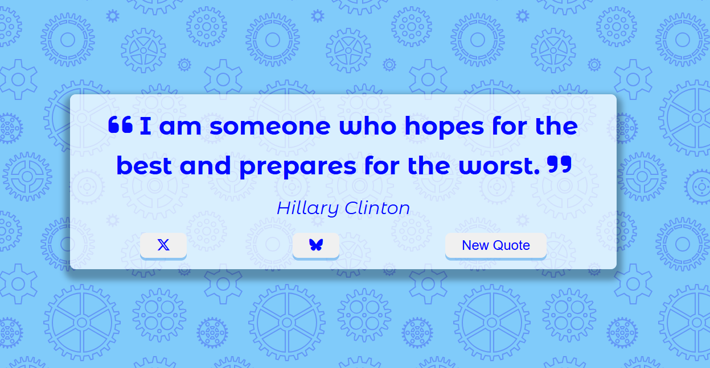

# Quote Generator

# DESCRIPTION
> Quote generator is a simple frontend webpage. It  fetches quotes from an API to generate random quotes with authors. Include are 3 button, the 'X-twitter' which allows posting to the platform; the 'BlueSky' button to post on the platform. Both require the user to be logged-in the platform. Then the simple new quote button to change the quote. HTML is short and to the point, while the styling is fully CSS included the hover and animation on the buttons. JavaScript is used for the fetching of the API while using a try/catch.
# TECH
> - HTML 5
> - CSS 3
> - JavaScript (ES7)
> - Font Awesome
> - Hero patterns
> - Google Fonts

# DESIGN
> The design was taken from another project. I am not a designer and have trouble making everything look pretty. I used Hero patterns website to get the background SVG. Google font 'Montserrat Alternates'.
>
# FEATURES
> Only features is that it post to either X-Twitter or Bluesky. It also randomizes the API.
# AUTHOR
#  **Blue Byrd Development**
## *Karen Byrd* 2024
